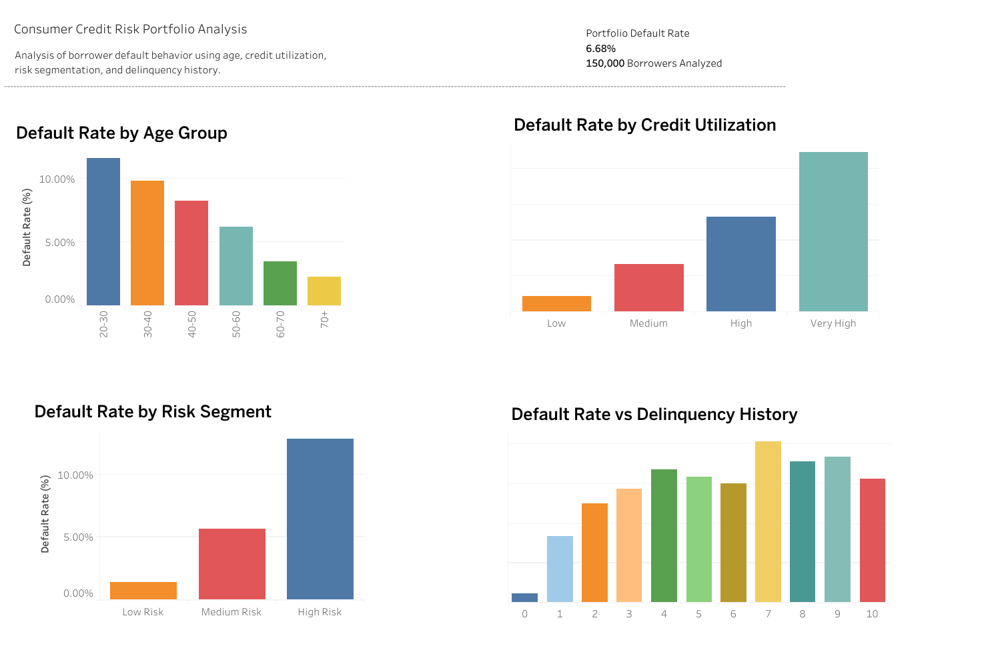

# Consumer Credit Risk Portfolio Analysis

A data analytics project investigating borrower credit behavior and identifying key drivers of financial distress using a large credit dataset.

The analysis explores how factors such as **age**, **credit utilization**, **delinquency history**, and **borrower risk segmentation** influence default probability. Final insights are presented through an interactive **Tableau dashboard** designed for portfolio risk monitoring.

---

## Interactive Dashboard (Tableau Public)

Explore the interactive version here:  
🔗 **[Tableau Public Dashboard](https://public.tableau.com/views/ConsumerCreditRiskPortfolioAnalysis/Dashboard1?:language=en-US&:sid=&:redirect=auth&:display_count=n&:origin=viz_share_link)**

### Dashboard Preview

---

## Dataset

The dataset used is the well-known **Give Me Some Credit** credit risk dataset.

It contains borrower financial indicators used to predict serious delinquency within the next two years.

- **Total Borrowers:** 150,000  
- **Target Variable:** `SeriousDlqin2yrs`

| Value | Meaning                                    |
|-------|--------------------------------------------|
| 0     | No serious delinquency                     |
| 1     | Serious delinquency within 2 years         |

---

## Project Objectives

- Understand borrower behavior patterns
- Identify key drivers of default risk
- Segment borrowers based on risk level
- Visualize portfolio risk patterns
- Communicate insights through an executive dashboard

---

## Key Features Used

| Feature                                    | Description                          |
|--------------------------------------------|--------------------------------------|
| RevolvingUtilizationOfUnsecuredLines       | Credit utilization ratio             |
| age                                        | Borrower age                         |
| DebtRatio                                  | Debt-to-income ratio                 |
| MonthlyIncome                              | Monthly income                       |
| NumberOfOpenCreditLinesAndLoans            | Total active credit lines & loans    |
| NumberOfTimes90DaysLate                    | Number of 90+ days late delinquencies|
| NumberOfDependents                         | Number of household dependents       |

---

## Data Preparation

Several preprocessing steps were applied:

- Removed extreme outliers
- Handled missing values in `MonthlyIncome` and `NumberOfDependents`
- Inspected feature distributions
- Standardized column formats

---

## Feature Engineering

Created derived features to improve risk pattern analysis:

### Age Groups

Borrowers were grouped into these life-stage buckets:

- 20–30  
- 30–40  
- 40–50  
- 50–60  
- 60–70  
- 70+

### Credit Utilization Bands

Credit utilization segmented into four categories:

- Low  
- Medium  
- High  
- Very High  

(Higher utilization often signals financial stress)

### Risk Segmentation

Borrowers classified into three portfolio segments:

- **Low Risk**  
- **Medium Risk**  
- **High Risk**  

These segments help prioritize monitoring and risk controls.

---

## Portfolio Metrics

| Metric                     | Value    |
|----------------------------|----------|
| Borrowers Analysed         | 150,000  |
| Portfolio Default Rate     | **6.68%**|

---

## Key Insights

1. **Younger Borrowers Show Higher Risk**  
   Borrowers aged **20–30** have significantly higher default probability.  
   Risk declines steadily with increasing age.

2. **Credit Utilization Strongly Predicts Default**  
   Borrowers with **Very High** utilization show dramatically higher default rates compared to **Low** utilization groups.

3. **Risk Segmentation Clearly Separates Behavior**  

   | Segment     | Default Risk Description              |
   |-------------|----------------------------------------|
   | Low Risk    | Very low default probability           |
   | Medium Risk | Moderate default probability           |
   | High Risk   | Significantly elevated default probability |

4. **Delinquency History is the Strongest Signal**  
   Previous **90-day delinquencies** are one of the most powerful predictors of future serious delinquency.

---

## Tools Used

- Python  
- Pandas  
- NumPy  
- Matplotlib / Seaborn  
- Tableau Public

---
## Business Value

This project demonstrates how data analytics supports **credit risk management** and **portfolio monitoring**.

Financial institutions can apply similar analyses to:

- Identify high-risk borrowers early  
- Refine credit approval policies  
- Monitor portfolio risk exposure in real time  
- Reduce future loan losses
